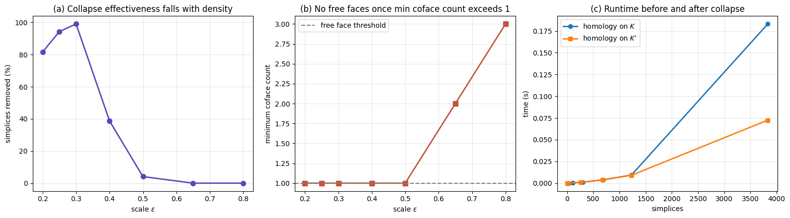

# Simplicial Homology and Elementary Collapses

A from-scratch implementation of the Zomorodian–Carlsson reduction
algorithm for computing simplicial homology over F₂, together with
elementary collapses for reducing complex size.

## Files

- `core.py` — simplicial complexes, boundary matrices, Smith reduction,
  Betti numbers, elementary collapses, comparison pipeline
- `homology_basis.py` — explicit homology generators (Nanda, Prop. 3.15)
- `density_sweep.py` — experiment: when do collapses actually help?

## Quick start

```python
from core import SimplicialComplex, compute_homology, collapse
from homology_basis import describe_homology

K = SimplicialComplex([[0,1],[0,2],[1,2]])   # hollow triangle
print(compute_homology(K))                    # {0: 1, 1: 1}
describe_homology(K)                          # H_1 generator: 01 + 02 + 12
```

## Verification

Betti numbers over F₂ agree with known values and with GUDHI:

| Complex | β |
|---|---|
| Hollow triangle | (1, 1) |
| Solid triangle | (1, 0, 0) |
| Hollow tetrahedron | (1, 0, 1) |
| Annulus | (1, 1, 0) |
| Torus (Császár) | (1, 2, 1) |

## Main finding

Elementary collapses are effective on Vietoris–Rips complexes only in a
narrow window of scales. Below it the topology isn't yet resolved; above it
every codimension-one face has at least two cofaces, so no free face exists
and no collapse is possible.



## References

- A. Zomorodian and G. Carlsson, *Computing Persistent Homology*, SoCG 2004
- V. Nanda, *Computational Algebraic Topology*, Oxford lecture notes

## Acknowledgements

Advised by Prof. Kaushik Kalyanaraman (IIIT Delhi).
